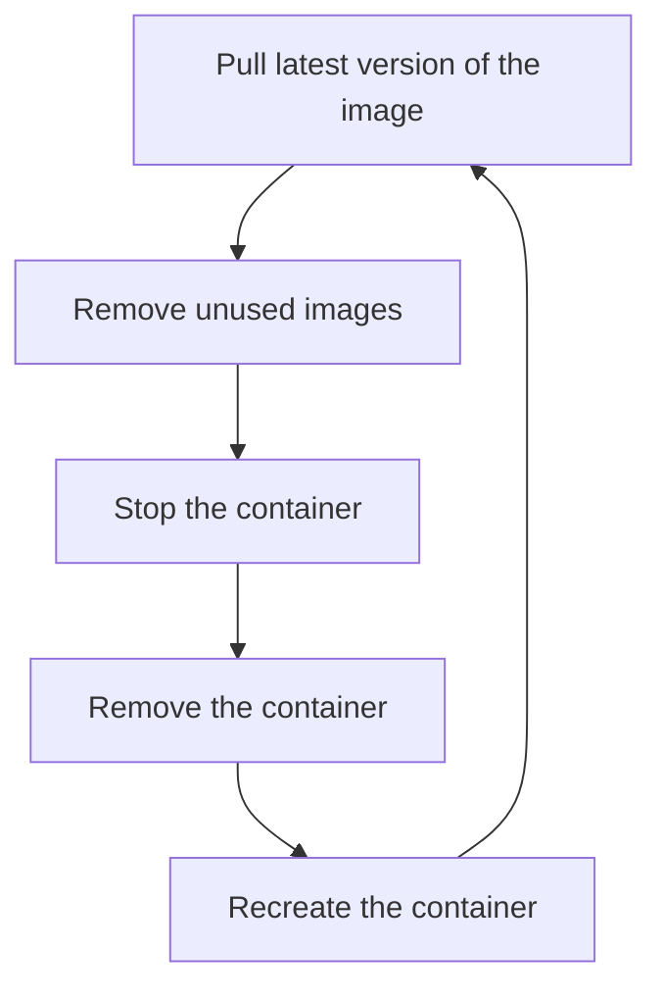

## Name: Makayla Carr
 cicd-3120-makaylac02

# Notes :
* I just want to add that my DockerFile can be found in my website folder. 

# Part 1 - Dockerize it
## Documentation

* Project Overview:
  * Applying our docker knowledge.
* Installing docker + dependencies:
  * I installed WSL2 Docker at this website: https://docs.docker.com/desktop/windows/install/
    * Once installed, verify WSL2 engine is turned on.
* Building the container: 
  * I created a directory called website that will hold my html file named hello.html and a Dockerfile.
  * I then used the temple provided from this website: https://hub.docker.com/_/httpd . This was used in my Dockerfile.
  * I then used the command: 'docker build . -t hello-test' to build a container named hello-test
* How to run the container: 
  * Now to run the container I just built, I run the command: docker run -p 80:80 -d --name container-hello hello-test
* How to view the project:
  * Since I used the source, https://hub.docker.com/_/httpd, I only need to type in localhost to see my site. If I had not had a port attached, then I may have had to type something like localhost:8080.

  # Part 2 - GitHub Actions and DockerHub
  
* Create DockerHub public repo, process to create:
  * To create a DockerHub public repo, I first had to create an account on DockerHub. I chose the free option and used my school email to sign up. Then, I hit the create repository button. I named my repository, "site", I did not set a description, and I set the repository to public. 
* How to authenticate with Dockerhub via CLI using Dockhub credentials
  * First you will need to obtain your access token, which is located under the security tab in settings.
  * Then, in my ubuntu terminal, while the docker desktop app is open, I type the command: "docker login -u username". username being my DockerHub username. 
  * The password is the token that I obtained in the security tab. I am now authenticated
  * I can now use things like docker push and docker pull.
* Recommended credentials: 
  * A token is recommended over a password because it is harder to break. Also, if you use a password, and someone gets that password, things can become scary and dangerous. A unique token is a lot more safe.
* Configuring GitHub secrets
  * What does it do and when?
    * GitHub secrets allows us to keep our sensitive information that is needed to be written in our repos, safe. So, for example, I may want to put my Docker authentication token into a GitHub secret so that it is hidden and I can use the token without a second thought. 
  * Set secrets and secret names
    * I set DOCKER_USERNAME which contains my DockerHub username and DOCKER_PASSWORD which contains my DockerHub token.
* Behavior of Github workflow
  * What does it do and when? 
    * Github workflows are used to test, build, release, or deploy projects on Github. In my mind, I imagine it as a checklist. A way to keep organized and set a "flow of work".
  * Variables to change (repository, etc.)
    * name ( repository)
    * when to run ( what event )
      * ex. on a push, what branch
    * jobs ( set of things that happen when the event is triggered ) 
    * What are things running on
      * ex. ubuntu-latest
    * Job steps 
    * Most importantly, I used the template supplied from https://hub.docker.com/_/httpd and changed the secret names and Dockerhub repo name so that they matched mine.

  # Part 3 - Deployment

* Container restart script, what it does:
  * The container restart will stop, remove, and create the container whenever new content is pulled from my Dockerhub repo.
* Webhook task definition file, what it does: 
  * It directs itself to my script, 'containerRestartScript.sh' and applies it to the web, updating the web when necessary. 
* Setting up webhook: 
  * I followed the commands in the slides and the website: https://hub.docker.com/_/httpd.
  * Setting up the webhook required me to download webhook onto my terminal and then creating a json template. I installed using Go and made turned my json into a service as provided in the slides. 
* How I created my own listener
  * I created an end-point named "HELLO-END"
* How I installed and am running the webhook on github
  * So the outcome should have this: http://yourserver:9000/hooks/id?cheese=12s35g3., but I am getting an issues where my address is already in use. I've obtained this information from these 2 websites: https://hub.docker.com/_/httpd and https://github.com/adnanh/webhook.
* How do set up notifier in Github or DockerHub
  * I believe this is the resource that would be useful in doing this, for DockerHub specifically: https://docs.docker.com/registry/notifications/
    * We would need to add a section in our .json file that we created earlier, so that it knows how to send notifications. 
  * For Github, this is a resource that I found: https://docs.github.com/en/account-and-profile/managing-subscriptions-and-notifications-on-github/setting-up-notifications/configuring-notifications
    * For Github, it is more about adjusting the settings on a repo, and choosing who recieves what notificataions.
    
* Notes on how I got things working, any resources used outside of notes and lecture.
  * https://github.com/adnanh/webhook
  * https://hub.docker.com/_/httpd
  * https://docs.docker.com/desktop/windows/install/
  * https://docs.github.com/en/account-and-profile/managing-subscriptions-and-notifications-on-github/setting-up-notifications/configuring-notifications
  * https://docs.docker.com/registry/notifications/

# Part 4 - Diagram

